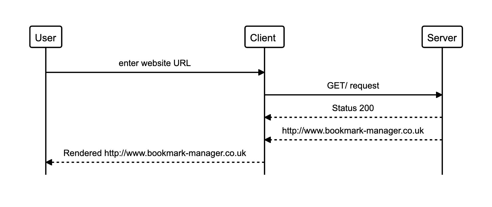

# Planning Document

## User Stories

### Story

```
As a user
So that I can use the website
I would like to see a list of bookmarks
```

### Domain Model

| Nouns               | Verbs  |
| ------------------- | ------ |
| list (of bookmarks) | to see |
|                     |        |

### Class Diagrams

| Class      | Bookmarks     |
| ---------- | ------------- |
| Attributes | bookmark_list |
| Methods    | display       |


