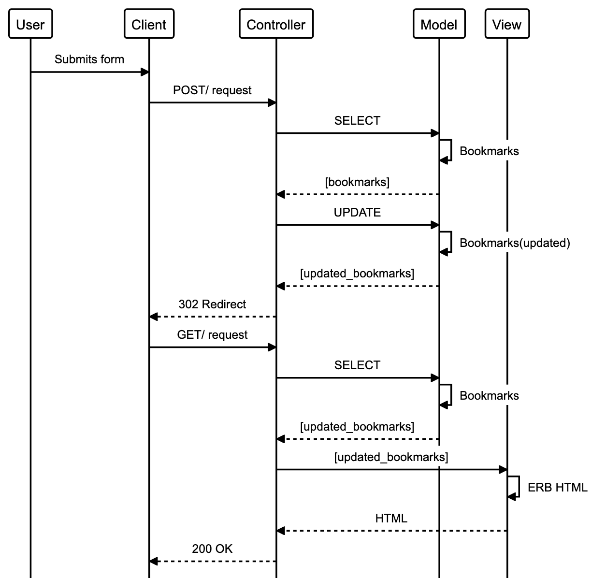

# Planning Document

## User Stories

### Story

```
As a user
So that I can use the website
I would like to see a list of bookmarks
```

### Domain Model

| Nouns               | Verbs  |
| ------------------- | ------ |
| list (of bookmarks) | to see |


### Story

```
As a user
So that I can save a website
I would like to add the site's address and title to bookmark manager
```

### Domain Model

| Nouns        | Verbs                   |
| ------------ | ----------------------- |
| site address | add to bookmark manager |
| site title   |                         |



### Class Diagrams

| Class      | Bookmarks     |
| ---------- | ------------- |
| Attributes | bookmark_list |
| Methods    | display, add  |
